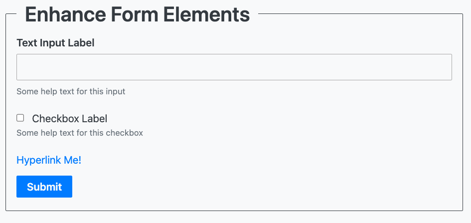
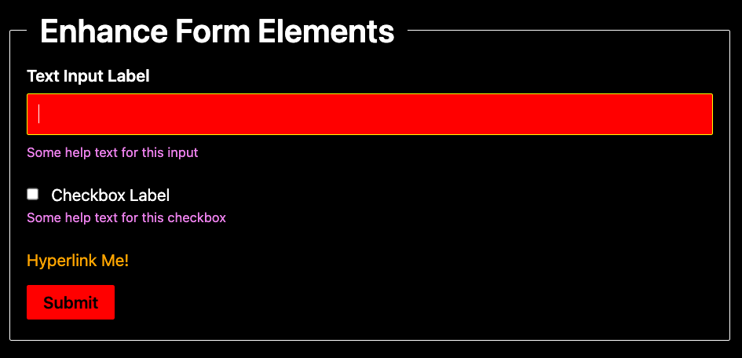

# Enhance Form Elements

Enhance Styles does a pretty hard CSS reset. As a result when building forms you would need to start from scratch. We have some form components pre built that will help you get up and running.

## Install

```bash
npm i @enhance/form-elements
```

Then re-export the form elements you want to use in your `app/elements` folder.

For example, if you wanted to use the `submit-button` component you would create a `app/elements/submit-button.mjs` with teh contents of:

```javascript
import { SubmitButton } from "@enhance/form-elements"
export default SubmitButton
```

> Note: if you want to rename the element, just change the file name in your elements folder. Eg. `app/elements/my-submit-button.mjs`

## Components

| tag | custom element | class |
| --- | --- | --- |
| input[type=checkbox] | check-box | CheckBox |
| fieldset | field-set | FieldSet |
| form | form-element | FormElement |
| a | link-element | LinkElement |
| div | page-container | PageContainer |
| button | submit-button | SubmitButton |
| input[type=text] | text-input | TextInput |

## Styling

By default the components are styled using the custom properties from Enhance Styles.



You can theme the components by setting your own values for the custom properties the components use. For example:

```css
  :root {
    --fe-background: red;
    --fe-muted: violet;
    --fe-border-color: purple;
    --fe-outline-color: green;
    --fe-error-color: pink;
    --fe-primary: orange;
    --fe-light: black;
    --fe-dark: white;
    --fe-button-color: red;
    --fe-button-color-hover: pink;
    --fe-border-color-focus: yellow;
  }
```

Produces:



Yes, it's ugly but you get the point.
